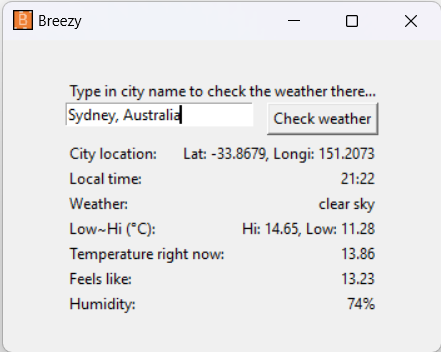

# `Breezy`: instantaneous weather report around the globe

`Breezy` is a Python + Tkinter Window app that lets you check the weather anywhere in the world instantaneously.

## How to run it
In Windows, simply:
1) Double click the orange icon with the letter B,  this runs `Breezy.exe`.
2) In the main window, type the name of the city you are interested in... Voila!
3) You will get the location (longitude and latitude), current time, weather and temperature instantaneously!
   


## Check the source code
The Python code is also included. As `Breezy` is calling a public API from https://api.openweathermap.org/data/2.5/weather, you will need to apply for your own API key at `https://openweathermap.org/api` for free. Once you add your API key to the following section of the code in Breezy.py, you can query the server 60 times per minute or 1,000,000 time per month!

```python
params = {
            'q': self.city,
            # Apply for a free API key from openweathermap.org
            'appid': 'your_free_api_key_from_openweathermap.org',
            'units': 'metric'
        }
```

